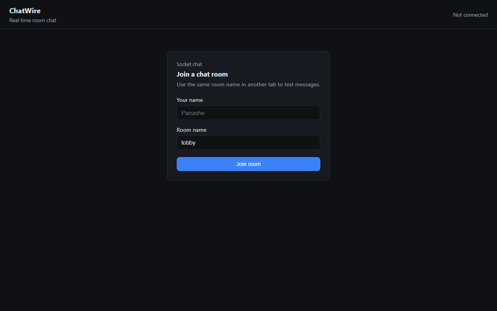
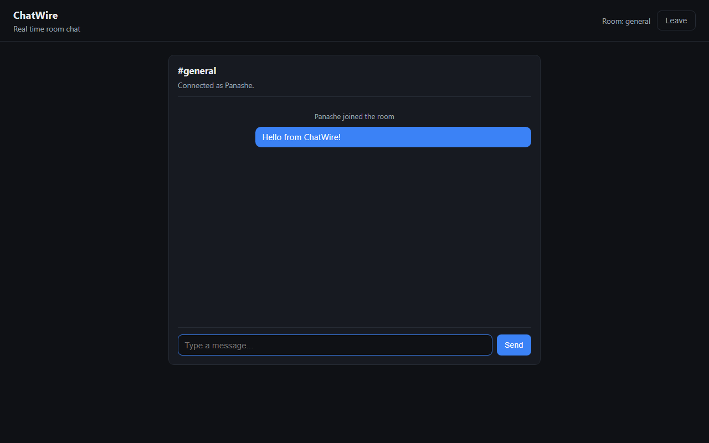

# ChatWire

**Built:** May 2026  
**Author:** [Panashe Sanyanga](https://github.com/code-by-panashe-sanyanga)

A real-time chat app built with Flask-SocketIO. Discord-style layout communities on the left rail, text channels in a sidebar, online users and a friends list, then the main chat. Open two tabs with different names to test live messaging.

Everything until ShopSphere was request/response HTTP. ChatWire was where I tried the server pushing updates Flask-SocketIO on the backend, plain HTML/CSS/JS on the front.

---

## What this project does

1. **Sign in** — register an account or log in with username and password.
2. **Communities** — three demo servers (Dev Hub, MMU Year 3, Gaming Lounge) on the left rail. Rename them with **Rename** in the sidebar header.
3. **Channels** — text channels per community. Use **Rename** next to Text Channels to rename the active channel.
4. **Sidebar members** — who is online right now, plus a seed friends list.
5. **Real-time chat** — messages, join/leave notices, typing indicator.
6. **Edit your messages** — hover your own messages and click Edit.
7. **Account** — change display name or password from the bottom-left panel.

Demo login: **demo** / **demo123**

No chat history is stored across server restarts — switching channels reloads recent messages from memory while the server is running.

---

## Why I chose each technology

| Technology | Why I used it |
|------------|---------------|
| **Flask** | Same Python web stack as my other spring projects — serves the HTML page and hosts Socket.IO on one process. |
| **Flask-SocketIO** | Wraps Socket.IO so I did not have to write raw WebSocket handlers. Handles rooms, broadcasts, and fallbacks. |
| **Socket.IO (CDN client)** | Official browser client loaded from a CDN — no npm build for the frontend. |
| **`async_mode="threading"`** | Avoids installing eventlet or gevent; good enough for a local demo with a few tabs. |
| **Vanilla JS** | Focus on connection lifecycle: connect → join → listen → emit. |

---

## Folder structure

```
ChatWire/
├── app.py                 # Flask + SocketIO server
├── communities.json       # Demo communities, channels, friends list
├── requirements.txt
├── static/
│   ├── index.html         # Discord-style shell
│   ├── style.css
│   └── app.js
└── README.md
```

---

## How to run it

### Prerequisites

- Python 3.10 or newer

### Installation

```bash
python -m venv venv
venv\Scripts\activate        # Windows
# source venv/bin/activate   # macOS/Linux

pip install -r requirements.txt
python app.py
```

Open **http://localhost:5001**

**Demo account:** `demo` / `demo123`

Register a new account from the Register tab, or log in with the demo user. Open a second tab with another account to test live chat.

---

## Frontend files in detail

| File | What it does |
|------|----------------|
| **static/index.html** | Join form (`user`, `room` inputs), chat section (message list, input, send button), and a script tag for the Socket.IO client from CDN. |
| **static/style.css** | Hides chat until joined, styles message bubbles (`.mine` vs others), system message text, and the room title. |
| **static/app.js** | Creates `io()` connection, handles join button → `emit('join')`, listens for `message` events and appends DOM nodes, sends user messages on submit, tracks `currentUser` and `currentRoom` for layout and payloads. |

---

## Backend files in detail

| File | What it does |
|------|----------------|
| **app.py** | Flask app with `SECRET_KEY`, `SocketIO` instance, static file routes, and handlers: `on_join` (join_room + system message), `on_message` (broadcast to room), `on_disconnect` (leave notice). Keeps `users` dict mapping socket id → `{ user, room }`. Runs on port **5001** with `allow_unsafe_werkzeug=True` for local dev. |
| **requirements.txt** | Lists Flask, flask-socketio, and related dependencies. |

### Socket events

| Event | Direction | Payload | Description |
|-------|-----------|---------|-------------|
| `session_start` | Client → Server | `{ user, community?, channel? }` | Connect and join first channel |
| `join_channel` | Client → Server | `{ community, channel }` | Switch community or channel |
| `message` | Client → Server | `{ text }` | Send chat text |
| `edit_message` | Client → Server | `{ id, text }` | Edit your own message |
| `update_display_name` | Client → Server | `{ user }` | Change display name |
| `typing` | Client → Server | `{ typing }` | Typing indicator |
| `session_ready` | Server → Client | layout + active community/channel | Initial state |
| `channel_switched` | Server → Client | `{ community, channel, clear }` | UI should clear messages |
| `channel_history` | Server → Client | `{ messages }` | Recent messages when joining a channel |
| `presence` | Server → Client | `{ online, friends }` | Sidebar member lists |
| `message` | Server → Client | `{ id, user, text, system?, at, edited_at? }` | Chat or system line |
| `message_edited` | Server → Client | updated message object | Everyone sees the edit |
| `display_name_updated` | Server → Client | `{ user }` | Your name changed |
| `user_renamed` | Server → Client | `{ old_name, new_name }` | Update names on old messages |
| `typing` | Server → Client | `{ user, typing }` | Someone is typing |

### Example — send from browser console

```javascript
socket.emit('message', {
  user: 'Panashe',
  room: 'general',
  text: 'Hello everyone'
});
```

---

## JSON in this project

ChatWire does not use a static JSON data file. Messages are **JSON objects** sent over Socket.IO:

```json
{ "user": "Alex", "text": "hi", "system": false }
```

System events use the same shape with `"system": true` and text like `"joined the room"`.

There is no `messages.json` or database — messages exist only in the browser DOM until you refresh.

---

## venv — what not to upload

| Commit | Do not commit |
|--------|----------------|
| `app.py`, `static/`, `requirements.txt`, `screenshots/` | `venv/`, `__pycache__/`, `.pyc` |

No `node_modules` — the Socket.IO client is loaded from a CDN in `index.html`.

---

## Screenshots





---

## Limitations and possible improvements

**Current limitations**

- No persisted chat history — refresh clears messages.
- No private messages or direct chats.
- No authentication — any display name works.
- Not load-tested for many simultaneous users.
- `SECRET_KEY` and `cors_allowed_origins="*"` are dev settings only.
- Intended for `localhost` learning, not production deployment.

**Ideas for later**

- Store recent messages per room in Redis or SQLite.
- Login with real accounts and avatar images.
- Typing indicators and “user is online” list.
- Deploy behind a production ASGI server with eventlet/gevent if scaling up.
- Rate limiting to reduce spam in open rooms.

---

## Troubleshooting

| Problem | What to try |
|---------|-------------|
| **Messages not appearing in other tab** | Both tabs must join the **same room name** (case-sensitive). Use different display names to tell users apart. |
| **Connection errors in console** | Confirm `python app.py` is running on port 5001. Check firewall is not blocking localhost. |
| **Page loads but socket never connects** | Ensure the Socket.IO CDN script loads (needs internet for first visit). Check browser console for errors. |
| **Only system messages, no user text** | Make sure you joined first and the message input is not empty. |
| **Port 5001 in use** | Stop other apps on 5001 or change the port in `socketio.run(...)` at the bottom of `app.py`. |
| **`ModuleNotFoundError`** | Activate `venv` and run `pip install -r requirements.txt`. |

---

## Links

- [Portfolio](https://github.com/code-by-panashe-sanyanga/PS-PORTFOLIO)
- [GitHub profile](https://github.com/code-by-panashe-sanyanga)
