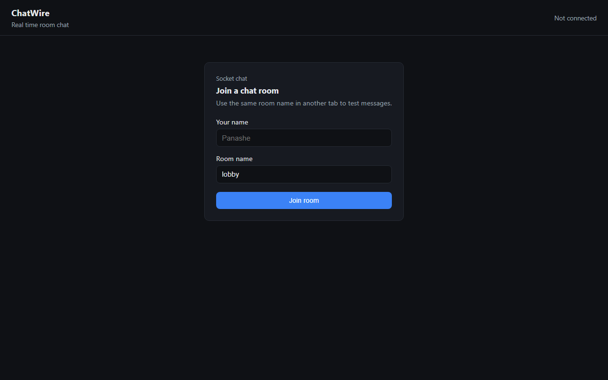
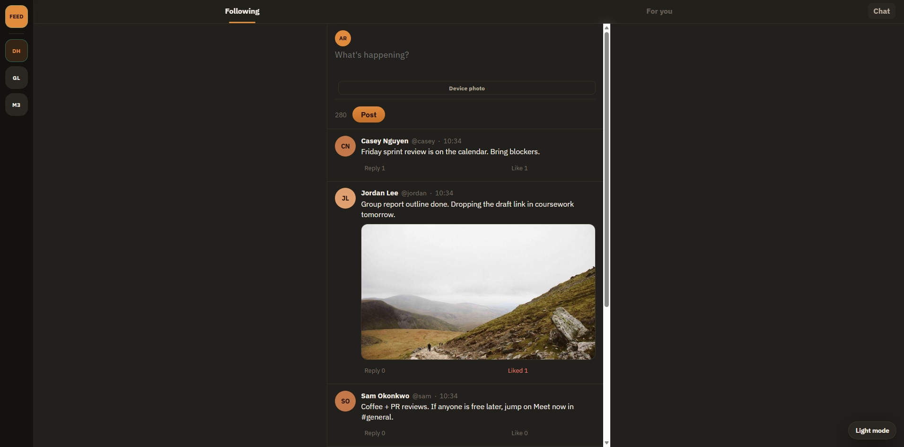
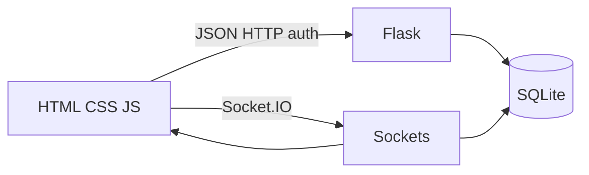
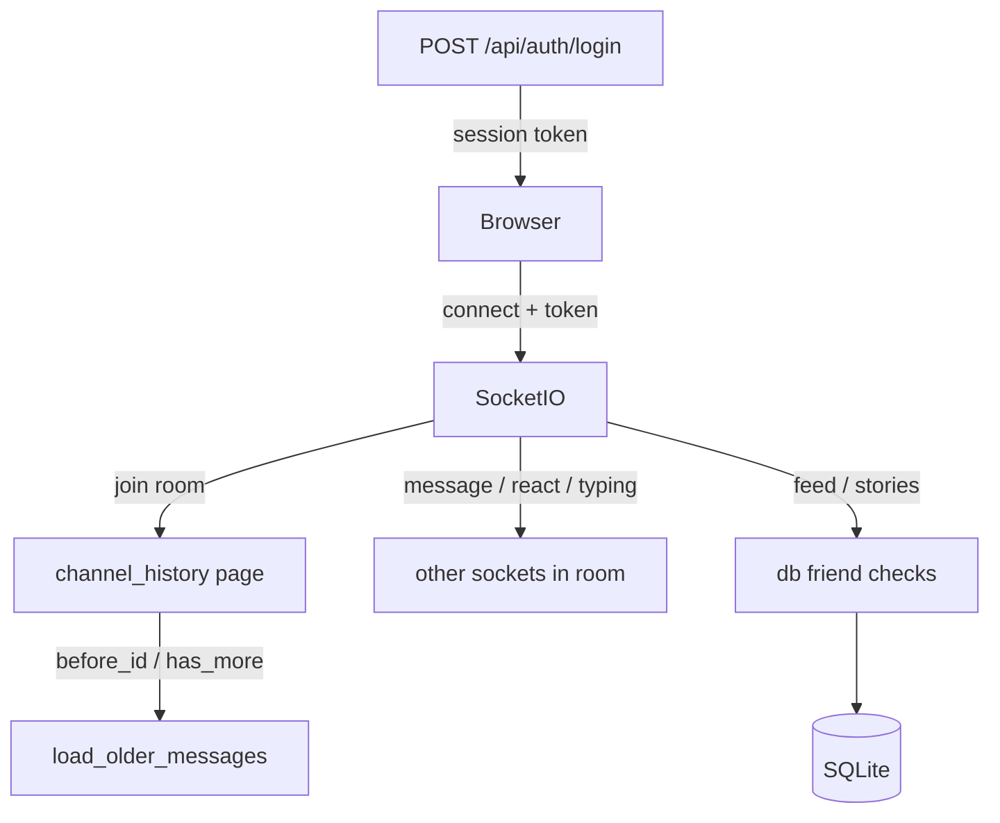

# ChatWire

Real-time chat with a Discord-style layout: communities, channels, DMs, friends, a social feed, 24h stories, and optional Meet now audio/video. The latest pass folds that into four modes, **Home**, **Explore**, **Chat**, and **You**, still one Flask + Socket.IO app, not seven separate clones. Accounts, history, friends, and the feed live in SQLite; who is online stays in memory.

**Live:** [chat-wire-production.up.railway.app](https://chat-wire-production.up.railway.app) · **Stack:** HTML, CSS, JS, Python, Flask, Flask-SocketIO, SQLite, WebRTC

Demo login: **demo** / **demo123456** (admin account, so rename works in demos)

Other seeded accounts: `sam` / `sam1234567`, `jordan` / `jordan1234`, `casey` / `casey12345`

## Screenshots

### v1: room join chat

The first version was a single shared room: type a display name, pick a room, messages appear live. No accounts, no history after restart.




### v2: accounts, communities, feed

v2 replaced the room-name join form with real login, Discord-style communities and channels, a friends feed, stories, and Meet now.




## What I changed

**From v1 to v2.** Dropped anonymous “display name + room” join. Added accounts (register / login / session token), SQLite for messages and friends, communities with channels, DMs, a friends-only feed and 24h stories, presence/status, and Meet now. Privacy checks moved into the data layer so guessing a post id is not enough.

**Since v2 (current).** Reshaped the UI into Home / Explore / Chat / You so the product reads as one consumer app. Explore covers For You ranking, Clips, and Rooms. You is a real profile surface (posts, reposts, private Saved boards, stories) and you can open someone else’s profile with Follow / Message. Saved stays owner-only. Device photo/video uploads, quote posts, WebRTC on Meet now (optional TURN), and a Railway volume via `DATA_DIR` so the DB and uploads survive deploys. Hardened secrets on Railway and closed a few Saved/board privacy holes that the UI hide alone would not have fixed.

## Why

I had mostly built request/response HTTP APIs. ChatWire was the place to learn server push, reconnect auth, and permission checks outside a banking context: messages that appear in another browser without a refresh, a session token that survives a reload, and feed/story reads that refuse strangers even when the post id is easy to guess.

## Product map

| Mode | What it covers |
|------|----------------|
| **Home** | Following / For You timeline, create post, quotes |
| **Explore** | Media-first discovery, Clips, Rooms |
| **Chat** | Communities, channels, DMs, Meet now / Go live |
| **You** | Profile, posts/reposts, private Saved, stories; open others’ profiles |

Familiar habits mapped into one product (depth is intentionally thin next to the real apps):

| ChatWire | Habit it covers |
|----------|-----------------|
| Hubs / Chat | Discord communities / channels / live |
| Wire / Home | X timeline, For You, quotes, trends |
| Clips | TikTok-style short video |
| Pulse | Snapchat-style ephemeral 1:1 (friends, 24h) |
| Rooms | Reddit-style community posts + votes |
| Boards / Saved | Pinterest-style pins (owner only) |
| Stories | Instagram-style 24h (friends) |

## Features

- Communities and text channels with live messages, typing, reactions, and edit
- Direct messages; open profiles from the feed with Follow / Message
- Online presence and status (available / busy / away)
- Friends-visible posts and 24h stories; **Saved boards are private** to the owner
- Meet now channel calls with optional mic/camera (WebRTC; `/api/webrtc/ice` supports TURN via env)
- Go live in a channel + screen share
- Explore: For You ranking, Clips, Rooms, follows, votes
- Device photo and short-video uploads for chat, timeline, stories, and Clips
- Dark / light theme toggle
- Ctrl+K channel switcher
- Login lockout, password rules, and per-connection write rate limits
- Admin rename for communities and channels
- `/api/version` (`4.4.0`) for deploy checks

## How it works


```mermaid
flowchart LR
 UI[HTML CSS JS] -->|JSON HTTP auth| Flask
 UI -->|Socket.IO| Sockets
 Flask --> SQL[(SQLite)]
 Sockets --> SQL
 Sockets --> UI
```

Login and password changes go through Flask (`/api/auth/*`). Everything live (messages, typing, reactions, friends, feed, stories, channel calls, presence) goes through Socket.IO handlers under `sockets/`. Durable state is SQLite. `state.sessions` and `state.active_calls` are in-memory maps keyed by socket id / room; they reset on process restart and that is fine for a demo.

Channel history loads once with cursor pagination (`before_id` / `has_more`), then new events append. Switching rooms does not replay the whole history. Unread counts and DM threads are stored in SQLite (`channel_reads`, `_dm` channels) and pushed over sockets.


```mermaid
flowchart TD
 Login[POST /api/auth/login] -->|session token| Browser
 Browser -->|connect + token| SocketIO
 SocketIO -->|join room| History[channel_history page]
 History -->|before_id / has_more| Older[load_older_messages]
 SocketIO -->|message / react / typing| Peers[other sockets in room]
 SocketIO -->|feed / stories| FriendsCheck[db friend checks]
 FriendsCheck --> SQL[(SQLite)]
```

`app.py` owns HTTP auth, uploads, health, and ready. `sockets/` owns the live events. `db.py` / `db_ext.py` are the SQL schema and social queries. `state.py` holds online presence, session helpers, and call rooms. `throttle.py` rate-limits write events per connection. `validate.py` checks payloads. `static/` is the UI, including the Ctrl+K channel switcher. `seed.py` loads optional sample data. `tests/` is the pytest suite.

## Decisions

**Socket.IO for live traffic, JSON HTTP for auth.** Login needs a normal request/response and a token the browser can keep. After that, the socket reconnects with the signed token instead of the password. Keeping auth on HTTP means the lockout and password rules sit in one place (`app.py` + `state.py`) and the change-password route reuses the same lockout path as login.

**SQLite for durable data, memory for presence.** Messages, friends, posts, stories, and unreads need to survive a restart. Online status and "who's in this channel call" change every second and do not. That split keeps the demo simple; it also means presence and call banners reset when the process restarts. On Railway, mount a volume and set `DATA_DIR=/data` so the DB and uploads survive deploys.

**Friends / visibility checks in the data layer, not only the UI.** Feed posts and stories are readable or likeable only when the viewer is allowed. `db` / `db_ext` helpers return `None` or empty for strangers, so guessing a sequential id is not enough. Saved pins are owner-only even if someone knows the board id. The UI hiding a button would not have been enough on its own.

**Meet now = presence room + optional WebRTC.** Join/leave still uses an in-memory `active_calls` map over Socket.IO. Mic and camera are optional peer media via WebRTC once both sides are in the call. Signalling rides the same socket; TURN is optional via env.

**Got wrong: treating feed list filtering as enough privacy.** Early on, the feed query only returned friends' posts, but a direct like / comment / story-view by id still worked for any logged-in user. Post ids are sequential, so that was a real hole. The fix was putting the same check on every read and write helper, pinned by the strangers-cannot-access tests.

## Results

What's checkable from the test suite rather than guessed at:

- `pytest -q` covers auth hardening, message handlers, socket flows, `db_ext` social/privacy, and Wave helpers (`tests/test_wave.py`), **38** tests.
- Login returns a signed session token; the socket accepts that token on connect.
- Password rules reject short / letterless / numberless passwords; five wrong logins trigger a short lockout.
- Security headers (including CSP) are present on HTTP responses.
- Cursor pagination: a first history page can report `has_more`, and `load_older_messages` returns the earlier batch.
- Only the message owner can edit; a non-admin cannot rename a channel; an admin can.
- Friends-only posts and stories: a stranger cannot read, like, comment, or mark viewed.
- Profile Saved counts and board pins stay private to the owner.

## The hard bit

Feed and story privacy look fine in the UI until you remember post ids are sequential. Filtering the feed list to friends was not enough: a direct `get_post` / like / comment / story-view by id still worked for anyone who was logged in. The fix was to put the same friend check in every read and write helper, so a missing friendship returns `None` / an error before any mutation. The strangers-cannot-* tests are what actually pin that down now.

## Testing

```bash
pip install -r requirements-dev.txt
pytest -q
```

That covers auth hardening, message handlers (including friends-only feed/stories), socket flows, and social/privacy helpers.

What it deliberately does not cover: two-browser visual confirmation of live delivery, reconnect-after-refresh with the stored token, or Meet now media across tabs. Those stay manual. I also re-check the Railway URL and demo login after each deploy.

## Limitations

Single process: presence, call rooms, and login lockout are in-memory, so they do not share across workers and reset on restart. Without TURN, some NATs will fail WebRTC media. Multi-tab signalling picks one socket per username. `broadcast_presence()` personalises a payload per connected socket, which is fine at demo scale and wasteful beyond it. SQLite is the only database; that is enough for a portfolio demo and not a multi-node chat backend.

## Future improvements

- Move presence, call rooms, and login lockout into shared store (Redis or similar) so more than one worker can run without losing who is online.
- Prefer TURN in production for harder NAT cases on Meet now.
- Batch friend lookups inside `broadcast_presence()` instead of building a personalised payload per socket on every emit.
- Message and channel search, and Postgres if the demo ever needed more than one node writing at once.

## Running it

Prereqs: Python 3.12+. Node is not required.

```bash
git clone https://github.com/code-by-panashe-sanyanga/ChatWire.git
cd ChatWire
python3 -m venv venv
source venv/bin/activate  # Windows: .\venv\Scripts\activate
pip install -r requirements.txt
python app.py
```

Open http://localhost:5001. Optional sample data: `python seed.py`.

## Deploy (Railway)

See `RAILWAY.md`. Set `SECRET_KEY`, `DATA_DIR=/data` with a Railway volume mounted at `/data`, and `CORS_ORIGINS=*` (Railway sets `PORT`). After deploy, confirm the login screen (not the old room-join page) and that `demo` / `demo123456` works.
