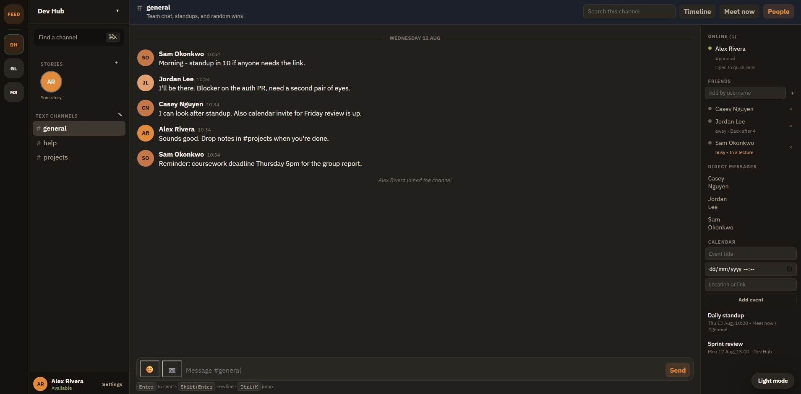
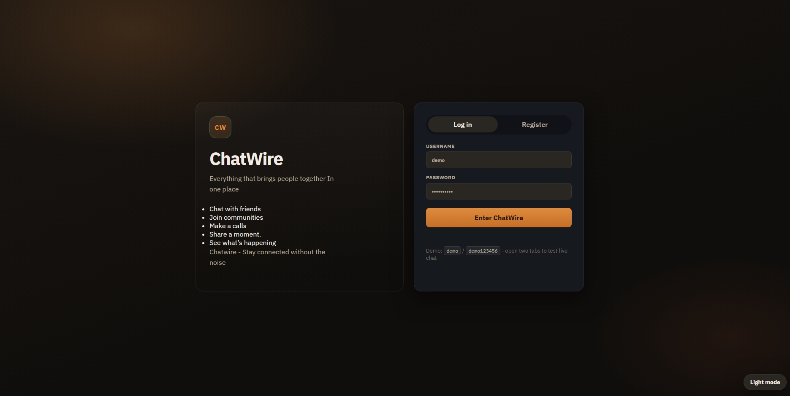
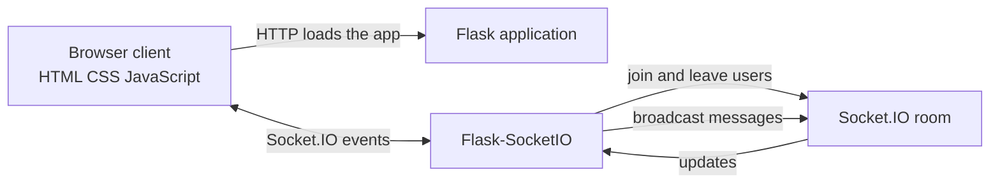
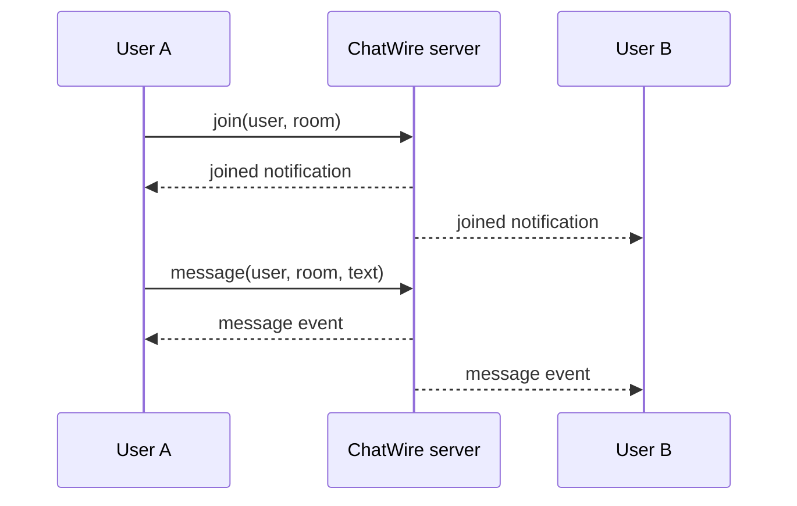

# ChatWire

ChatWire is a lightweight real-time chat application built with Flask and
Socket.IO. Choose a display name, enter a room, and exchange messages instantly
without refreshing the page.





## Features

- Join a room with a display name and room name.
- Send messages to everyone connected to the same room.
- Receive updates instantly through Socket.IO.
- Show join and leave notifications in the conversation.
- Distinguish your messages from messages sent by other users.
- Leave a room and return to the join screen at any time.

## Technology

- **Backend:** Python, Flask, and Flask-SocketIO
- **Frontend:** HTML, CSS, and JavaScript
- **Transport:** Socket.IO over WebSockets, with long-polling fallback
- **Runtime:** Flask-SocketIO threading mode for simple local deployment

## Quick Start

### Prerequisites

- Python 3.10 or newer
- pip

### Installation

```bash
git clone https://github.com/code-by-panashe-sanyanga/ChatWire.git
cd ChatWire
python -m venv venv
```

Activate the virtual environment:

```powershell
# Windows PowerShell
.\venv\Scripts\Activate.ps1
```

```bash
# macOS or Linux
source venv/bin/activate
```

Install the dependencies and start the server:

```bash
pip install -r requirements.txt
python app.py
```

Open [http://localhost:5001](http://localhost:5001) in your browser. To test
real-time messaging, open a second tab, choose a different display name, and
join the same room.

## Project Structure

```text
ChatWire/
├── app.py              Flask and Socket.IO server
├── requirements.txt    Python dependencies
├── README.md           Project documentation
├── screenshots/        Application screenshots
└── static/
    ├── index.html      Page structure and chat views
    ├── style.css       Interface styling
    └── app.js          Client-side Socket.IO behavior
```

## How It Works

When a user joins, the browser opens a Socket.IO connection and sends the user
name and room name to the server. Flask-SocketIO places that connection in a
room and broadcasts join, message, and disconnect events to the other members.
The client updates the conversation immediately when an event arrives.

### Application Flow


```mermaid
flowchart LR
  Browser[Browser client\nHTML CSS JavaScript]
  Server[Flask application]
  SocketIO[Flask-SocketIO]
  Room[Socket.IO room]

  Browser -->|HTTP loads the app| Server
  Browser <-->|Socket.IO events| SocketIO
  SocketIO -->|join and leave users| Room
  SocketIO -->|broadcast messages| Room
  Room -->|updates| SocketIO
```

### Message Flow


```mermaid
sequenceDiagram
  participant A as User A
  participant S as ChatWire server
  participant B as User B

  A->>S: join(user, room)
  S-->>A: joined notification
  S-->>B: joined notification
  A->>S: message(user, room, text)
  S-->>A: message event
  S-->>B: message event
```

## API Events

Join a room:

```json
{"user": "alice", "room": "lobby"}
```

Send a message:

```json
{"user": "alice", "room": "lobby", "text": "Hello"}
```

## Limitations

- Messages are stored in memory and disappear when the server restarts.
- The app does not provide accounts or authentication; names are display names.
- There are no private messages or persistent chat history.
- Threading mode is intended for a small demo, not high-traffic production use.

## Troubleshooting

- **The page does not load:** Confirm that the server is running and visit port
  `5001`.
- **Join does nothing:** Reinstall the dependencies with
  `pip install -r requirements.txt` and check the terminal for errors.
- **Messages do not appear:** Make sure both browser tabs use the same room name
  and check the browser console for Socket.IO connection errors.
- **Port 5001 is in use:** Change the port in the final `socketio.run` call in
  `app.py`.

## License

This project is available for learning and experimentation.
