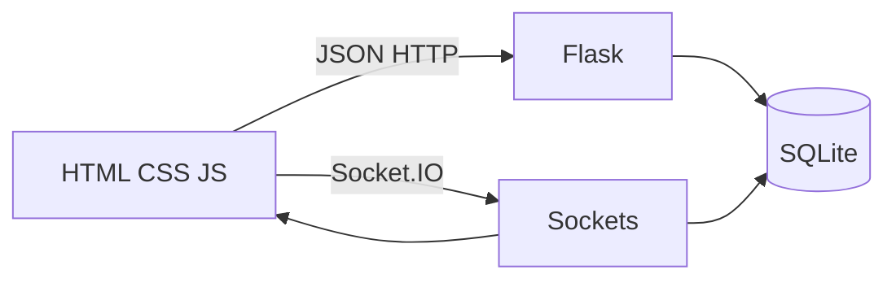

# ChatWire

**Stack:** HTML, CSS, JS, Python, Flask, JSON, SQL (SQLite)

Real-time chat with a Discord-style layout. The browser uses JSON HTTP calls
for login, and Socket.IO for live messages. Accounts and chat history live in
SQLite.

Demo login: **demo** / **demo123456** (admin account, so rename works in demos)

## Run locally

```bash
python3 -m venv venv
source venv/bin/activate
pip install -r requirements.txt
python app.py
```

Open http://localhost:5001  
Optional sample data: `python seed.py`

## How it fits together


```mermaid
flowchart LR
  UI[HTML CSS JS] -->|JSON HTTP| Flask
  UI -->|Socket.IO| Sockets
  Flask --> SQL[(SQLite)]
  Sockets --> SQL
  Sockets --> UI
```

| File | Job |
|------|-----|
| `static/` | UI (warm charcoal + amber palette, IBM Plex) |
| `app.py` | Flask routes (`/api/auth/*`, health, ready) |
| `sockets/` | Live chat / social / feed events |
| `db.py` | SQL schema + queries |
| `state.py` | Who is online (memory) + small helpers |
| `throttle.py` | Per-connection rate limits |
| `validate.py` | Plain Python payload checks |

## Tests

```bash
pip install -r requirements-dev.txt
pytest -q
```

## Design notes you can explain in an interview

- Passwords hashed with **bcrypt** (never stored plain)
- Login returns a **signed session token** (itsdangerous + SECRET_KEY). The browser reconnects with the token, not the password
- Register / change-password require **10+ chars with a letter and a number**; repeated failed logins get a short **lockout**
- Responses include basic **security headers** (CSP allows self + Socket.IO CDN + Google Fonts)
- Messages and users in **SQLite**; online presence stays in memory because it changes every second
- Only the message owner can **edit**; only **admins** (`users.is_admin`) can rename communities/channels (same idea as NovaBank role gates)
- Channel history uses **cursor pagination** (`before_id` / `has_more`) so the first load stays small
- **Unread counts** and **DM threads** are stored/queried in SQLite (`channel_reads`, `_dm` channels) and pushed over sockets
- Rate limits cover chat (message / react / typing) plus social/feed write paths (friends, events, posts, stories, renames, calls). Read-only loads are not throttled
- `broadcast_presence()` is fine at demo scale; at larger scale you would batch friend lookups into one JOIN instead of per-friend round trips
