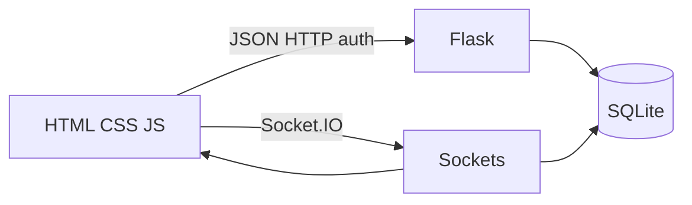

# ChatWire

Real-time chat with a Discord-style layout. The browser uses JSON HTTP for login and Socket.IO for live messages. Accounts, history, friends, and the feed live in SQLite; who is online stays in memory.


**Live:** [chat-wire-production.up.railway.app](https://chat-wire-production.up.railway.app)  
**Stack:** HTML, CSS, JS, Python, Flask, Flask-SocketIO, SQLite

Demo login: **demo** / **demo123456** (admin account, so rename works in demos)

## Why

I had mostly built request/response HTTP APIs. ChatWire was the place to learn server push, reconnect auth, and permission checks outside a banking context: messages that appear in another browser without a refresh, a session token that survives a reload, and feed/story reads that refuse strangers even when the post id is easy to guess.

## How it works


```mermaid
flowchart LR
  UI[HTML CSS JS] -->|JSON HTTP auth| Flask
  UI -->|Socket.IO| Sockets
  Flask --> SQL[(SQLite)]
  Sockets --> SQL
  Sockets --> UI
```

Login and password changes go through Flask (`/api/auth/*`). Everything live (messages, typing, reactions, friends, feed, stories, channel calls, presence) goes through Socket.IO handlers under `sockets/`. Durable state is SQLite. `state.sessions` and `state.active_calls` are in-memory maps keyed by socket id / room; they reset on process restart and that is fine for a demo.

Channel history loads once with cursor pagination (`before_id` / `has_more`), then new events append. Switching rooms does not replay the whole history. Unread counts and DM threads are stored in SQLite (`channel_reads`, `_dm` channels) and pushed over sockets.

| File | Job |
|------|-----|
| `static/` | UI (channels, DMs, feed, stories, Ctrl+K switcher) |
| `app.py` | Flask routes (`/api/auth/*`, health, ready) |
| `sockets/` | Live chat / social / feed / call presence events |
| `db.py` | SQL schema + queries |
| `state.py` | Online presence, session helpers, call rooms (in memory) |
| `throttle.py` | Per-connection rate limits |
| `validate.py` | Payload checks |
| `seed.py` | Optional sample data |
| `tests/` | pytest |

## Decisions

**Socket.IO for live traffic, JSON HTTP for auth.** Login needs a normal request/response and a token the browser can keep. After that, the socket reconnects with the signed token instead of the password. Keeping auth on HTTP means the lockout and password rules sit in one place (`app.py` + `state.py`) and the change-password route reuses the same lockout path as login.

**SQLite for durable data, memory for presence.** Messages, friends, posts, stories, and unreads need to survive a restart. Online status and "who's in this channel call" change every second and do not. That split keeps the demo simple; it also means presence and call banners reset when the process restarts.

**Friends checks in the data layer, not only the UI.** Feed posts and stories are readable or likeable only by the author or their friends. `db.get_post` / `toggle_post_like` / story view helpers return `None` for strangers, so guessing a sequential id is not enough. The UI hiding a button would not have been enough on its own.

**Channel "calls" are presence rooms, not WebRTC.** Meet now / Leave join an in-memory `active_calls` map and broadcast `call_updated` over Socket.IO. There is no mic, camera, or peer connection in this repo. That keeps the feature honest for a single-process demo.

## Results

What's checkable from the test suite (`pytest -q` collects **24** tests):

- Login returns a signed session token; the socket accepts that token on connect.
- Password rules reject short / letterless / numberless passwords; five wrong logins trigger a short lockout.
- Security headers (including CSP) are present on HTTP responses.
- Sending a message over the socket lands for the client; blank messages error.
- Cursor pagination: first history page can report `has_more`, and `load_older_messages` returns the earlier batch.
- Only the message owner can edit; a non-admin cannot rename a channel; an admin can.
- Unread summary + mark-read, DM thread creation, and add-friend over sockets.
- Friends-only posts and stories: a stranger cannot read, like, comment, or mark viewed.

## The hard bit

Feed and story privacy look fine in the UI until you remember post ids are sequential. Early on it was enough to filter the feed list to friends; a direct `get_post` / like / comment / story-view by id still worked for anyone who was logged in. The fix was to put the same friend check in every read and write helper in `db.py` (`get_post`, `toggle_post_like`, comment and story paths), so a missing friendship returns `None` / an error before any mutation. `test_strangers_cannot_access_friends_only_post` and `test_strangers_cannot_mark_friends_only_story_viewed` pin that down.

## Testing

```bash
pip install -r requirements-dev.txt
pytest -q
```

That covers auth hardening, message handlers (including friends-only feed/stories), and socket flows (send, pagination, edit ownership, admin rename, DMs, friends, unreads).

Manual checks that stay outside pytest: two browsers seeing a live message, reconnecting with the stored token after a refresh, and Meet now showing the same call banner for people in the channel.

## Limitations

- Single process. Presence, call rooms, and login lockout are in-memory; they do not share across workers and reset on restart.
- Channel calls are join/leave presence only, not audio/video.
- No file attachments and no dark/light theme toggle in the shipped UI.
- `broadcast_presence()` personalises a payload per connected socket (including a per-user friends list). Fine at demo scale; at larger scale you would batch friend lookups instead of doing that work per emit.
- SQLite is the only database. Fine for a portfolio demo; not a multi-node chat backend.

## Running it

```bash
python3 -m venv venv
source venv/bin/activate   # Windows: .\venv\Scripts\activate
pip install -r requirements.txt
python app.py
```

Open http://localhost:5001  
Optional sample data: `python seed.py`

## Deploy (Railway)

See `RAILWAY.md`. Set `SECRET_KEY` and `CORS_ORIGINS=*` (Railway sets `PORT`).
