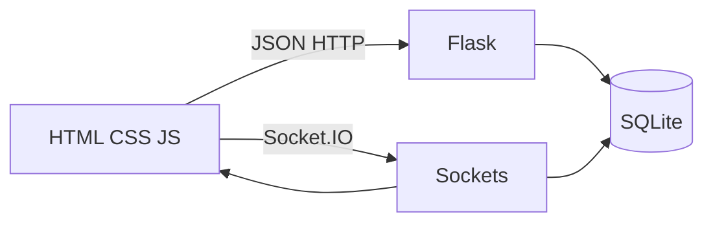

# ChatWire

Real-time chat with a Discord-style layout. The browser uses JSON HTTP for login and Socket.IO for live messages. Accounts and chat history live in SQLite.

**Live:** [chat-wire-production.up.railway.app](https://chat-wire-production.up.railway.app)  
**Stack:** HTML, CSS, JS, Python, Flask, Flask-SocketIO, SQLite

Demo login: **demo** / **demo123456** (admin account, so rename works in demos)

## Run locally

```bash
python3 -m venv venv
source venv/bin/activate   # Windows: .\venv\Scripts\activate
pip install -r requirements.txt
python app.py
```

Open http://localhost:5001  
Optional sample data: `python seed.py`

## How it fits together


```mermaid
flowchart LR
  UI[HTML CSS JS] -->|JSON HTTP| Flask
  UI -->|Socket.IO| Sockets
  Flask --> SQL[(SQLite)]
  Sockets --> SQL
  Sockets --> UI
```

| File | Job |
|------|-----|
| `static/` | UI |
| `app.py` | Flask routes (`/api/auth/*`, health, ready) |
| `sockets/` | Live chat / social / feed events |
| `db.py` | SQL schema + queries |
| `state.py` | Online presence (in memory) |
| `throttle.py` | Per-connection rate limits |
| `validate.py` | Payload checks |

## Security and behaviour

- Passwords hashed with bcrypt
- Login returns a signed session token (itsdangerous + `SECRET_KEY`); the browser reconnects with the token, not the password
- Register / change-password require 10+ chars with a letter and a number; repeated failed logins get a short lockout
- Responses include basic security headers (CSP allows self + Socket.IO CDN + Google Fonts)
- Only the message owner can edit; only admins can rename communities/channels
- Channel history uses cursor pagination (`before_id` / `has_more`)
- Rate limits cover chat and social write paths; read-only loads are not throttled

## Tests

```bash
pip install -r requirements-dev.txt
pytest -q
```

## Deploy (Railway)

See `RAILWAY.md`. Set `SECRET_KEY` and `CORS_ORIGINS=*` (Railway sets `PORT`).
