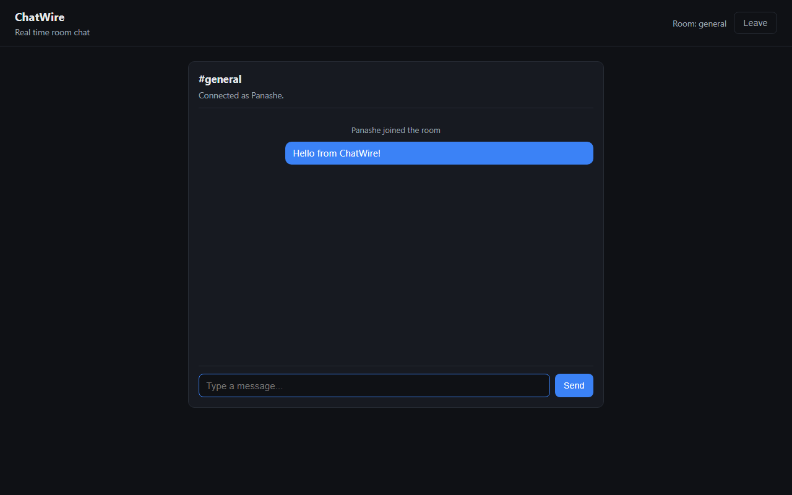
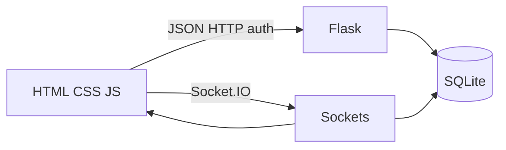
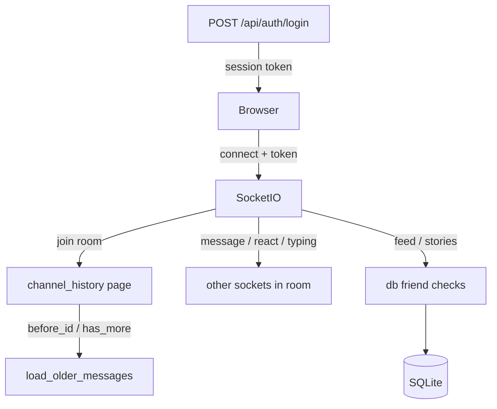

# ChatWire

Real-time chat with a Discord-style layout. The browser uses JSON HTTP for login and Socket.IO for live messages. Accounts, history, friends, and the feed live in SQLite; who is online stays in memory.



**Live:** [chat-wire-production.up.railway.app](https://chat-wire-production.up.railway.app) · **Stack:** HTML, CSS, JS, Python, Flask, Flask-SocketIO, SQLite

Demo login: **demo** / **demo123456** (admin account, so rename works in demos)

## Why

I had mostly built request/response HTTP APIs. ChatWire was the place to learn server push, reconnect auth, and permission checks outside a banking context: messages that appear in another browser without a refresh, a session token that survives a reload, and feed/story reads that refuse strangers even when the post id is easy to guess.

## How it works


```mermaid
flowchart LR
  UI[HTML CSS JS] -->|JSON HTTP auth| Flask
  UI -->|Socket.IO| Sockets
  Flask --> SQL[(SQLite)]
  Sockets --> SQL
  Sockets --> UI
```

Login and password changes go through Flask (`/api/auth/*`). Everything live (messages, typing, reactions, friends, feed, stories, channel calls, presence) goes through Socket.IO handlers under `sockets/`. Durable state is SQLite. `state.sessions` and `state.active_calls` are in-memory maps keyed by socket id / room; they reset on process restart and that is fine for a demo.

Channel history loads once with cursor pagination (`before_id` / `has_more`), then new events append. Switching rooms does not replay the whole history. Unread counts and DM threads are stored in SQLite (`channel_reads`, `_dm` channels) and pushed over sockets.


```mermaid
flowchart TD
  Login[POST /api/auth/login] -->|session token| Browser
  Browser -->|connect + token| SocketIO
  SocketIO -->|join room| History[channel_history page]
  History -->|before_id / has_more| Older[load_older_messages]
  SocketIO -->|message / react / typing| Peers[other sockets in room]
  SocketIO -->|feed / stories| FriendsCheck[db friend checks]
  FriendsCheck --> SQL[(SQLite)]
```

`app.py` owns HTTP auth, health, and ready. `sockets/` owns the live events. `db.py` is the SQL schema and queries. `state.py` holds online presence, session helpers, and call rooms. `throttle.py` rate-limits write events per connection. `validate.py` checks payloads. `static/` is the UI, including the Ctrl+K channel switcher. `seed.py` loads optional sample data. `tests/` is the pytest suite.

## Decisions

**Socket.IO for live traffic, JSON HTTP for auth.** Login needs a normal request/response and a token the browser can keep. After that, the socket reconnects with the signed token instead of the password. Keeping auth on HTTP means the lockout and password rules sit in one place (`app.py` + `state.py`) and the change-password route reuses the same lockout path as login.

**SQLite for durable data, memory for presence.** Messages, friends, posts, stories, and unreads need to survive a restart. Online status and "who's in this channel call" change every second and do not. That split keeps the demo simple; it also means presence and call banners reset when the process restarts.

**Friends checks in the data layer, not only the UI.** Feed posts and stories are readable or likeable only by the author or their friends. `db.get_post` / `toggle_post_like` / story view helpers return `None` for strangers, so guessing a sequential id is not enough. The UI hiding a button would not have been enough on its own.

**Channel calls use presence plus browser WebRTC.** Meet now still tracks who's in the room via an in-memory `active_calls` map and `call_updated` over Socket.IO. Mic and camera are optional: Settings can allow them, Meet now asks the browser for media, and peers exchange SDP/ICE through a `webrtc_signal` relay. There is STUN only (no TURN), so some restrictive NATs will show presence without audio/video.

**Got wrong: treating feed list filtering as enough privacy.** Early on, the feed query only returned friends' posts, but a direct like / comment / story-view by id still worked for any logged-in user. Post ids are sequential, so that was a real hole. The fix was putting the same friend check on every read and write helper, pinned by the strangers-cannot-access tests.

## Results

What's checkable from the test suite rather than guessed at:

- `pytest -q` collects **24** tests across auth hardening, message handlers, and socket flows.
- Login returns a signed session token; the socket accepts that token on connect.
- Password rules reject short / letterless / numberless passwords; five wrong logins trigger a short lockout.
- Security headers (including CSP) are present on HTTP responses.
- Cursor pagination: a first history page can report `has_more`, and `load_older_messages` returns the earlier batch.
- Only the message owner can edit; a non-admin cannot rename a channel; an admin can.
- Friends-only posts and stories: a stranger cannot read, like, comment, or mark viewed (`test_strangers_cannot_access_friends_only_post`, `test_strangers_cannot_mark_friends_only_story_viewed`).

## The hard bit

Feed and story privacy look fine in the UI until you remember post ids are sequential. Filtering the feed list to friends was not enough: a direct `get_post` / like / comment / story-view by id still worked for anyone who was logged in. The fix was to put the same friend check in every read and write helper in `db.py`, so a missing friendship returns `None` / an error before any mutation. The two strangers-cannot-* tests are what actually pin that down now.

## Testing

```bash
pip install -r requirements-dev.txt
pytest -q
```

That covers auth hardening, message handlers (including friends-only feed/stories), and socket flows (send, pagination, edit ownership, admin rename, DMs, friends, unreads).

What it deliberately does not cover: two-browser visual confirmation of live delivery, reconnect-after-refresh with the stored token, or Meet now banner sync across tabs. Those stay manual. I also re-check the Railway URL and demo login after each deploy.

## Limitations

Single process: presence, call rooms, and login lockout are in-memory, so they do not share across workers and reset on restart. Meet now WebRTC uses browser peer connections with a Socket.IO signal relay and public STUN only — no TURN — so audio/video can fail on strict NATs while the presence banner still works. Device photos upload to local disk under `data/uploads/` (jpg/png/gif/webp, 5 MB max); without a Railway volume those files reset on redeploy. Theme and mic/camera preferences are stored in the browser only (`localStorage`), not on the account. `broadcast_presence()` personalises a payload per connected socket, including a per-user friends list, which is fine at demo scale and wasteful beyond it. SQLite is the only database; that is enough for a portfolio demo and not a multi-node chat backend.

## Future improvements

- Move presence, call rooms, and login lockout into shared store (Redis or similar) so more than one worker can run without losing who is online.
- Add a TURN server (and screen share) so Meet now media works behind more NATs.
- Persist uploads on a Railway volume (or object storage) so device photos survive redeploys.
- Batch friend lookups inside `broadcast_presence()` instead of building a personalised payload per socket on every emit.
- Sync theme / media preferences to the account instead of browser-only storage.
- Message and channel search, and Postgres if the demo ever needed more than one node writing at once.

## Running it

Prereqs: Python 3.12+. Node is not required.

```bash
git clone https://github.com/code-by-panashe-sanyanga/ChatWire.git
cd ChatWire
python3 -m venv venv
source venv/bin/activate   # Windows: .\venv\Scripts\activate
pip install -r requirements.txt
python app.py
```

Open http://localhost:5001. Optional sample data: `python seed.py`.

## Deploy (Railway)

See `RAILWAY.md`. Set `SECRET_KEY` and `CORS_ORIGINS=*` (Railway sets `PORT`).
